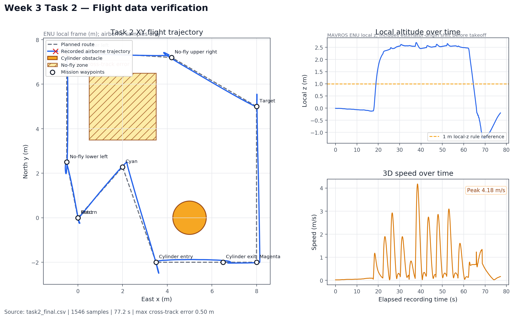
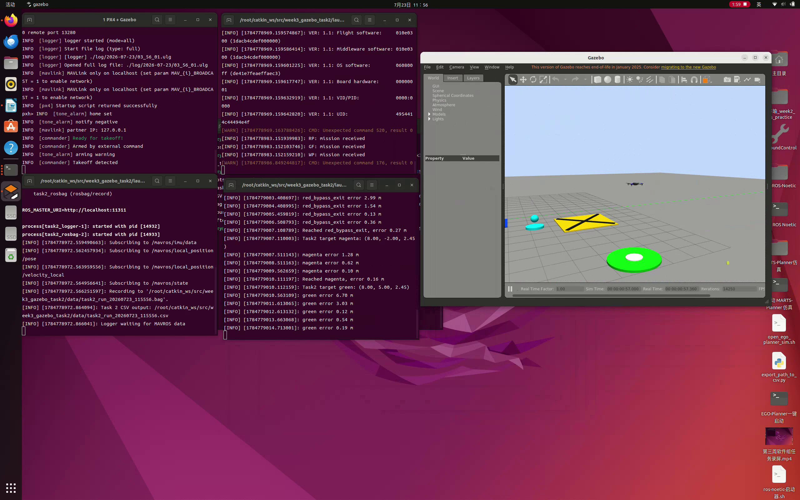
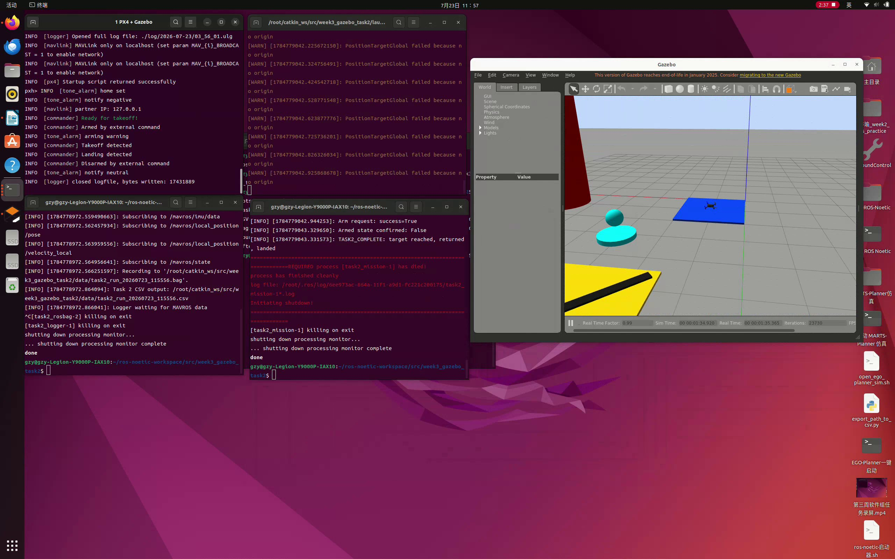
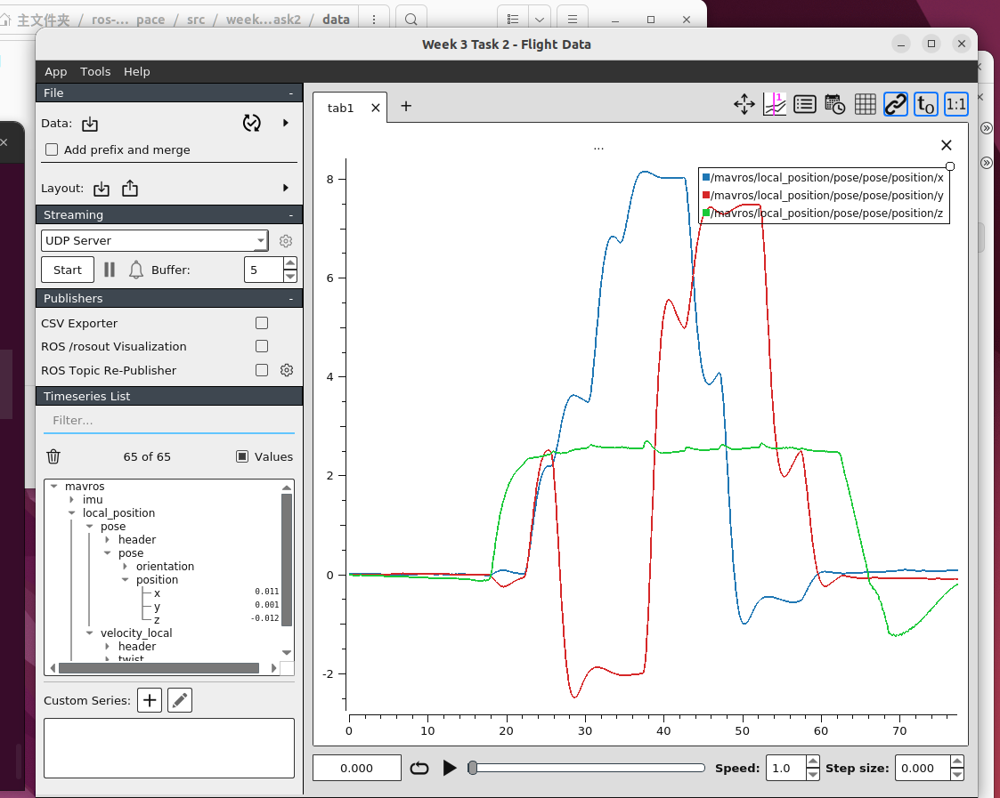

# week3_gazebo_task2

任务二独立工程：使用 ROS Noetic、PX4 SITL、Gazebo Classic 11 和 MAVROS，在自定义场景中完成绕障飞行、目标点到达、返航、降落、数据记录与轨迹分析。

本包不引用或修改 `week3_offboard`。



## 验收截图

录屏中的 Gazebo 飞行画面，可见 Iris、自定义起降点、航点、目标点和黄色
禁飞区：



任务结束画面中，飞控终端显示
`TASK2_COMPLETE: target reached, returned, landed` 和
`Armed state confirmed: False`：



## 1. 已完成内容

- 自定义 Gazebo world，包含红色圆柱、绿色目标点、黄色禁飞区和蓝色起降点。
- Iris 自动起飞至相对起点 2.5 m。
- 沿南侧通道绕过红色圆柱，不进入黄色禁飞区。
- 到达绿色目标点后原路返航并自动降落。
- 以 CSV 和 rosbag 记录位置、高度、速度、姿态及飞行状态。
- 生成 XY 轨迹、高度和速度分析图。
- 挑战规则：巡航航点不得低于 1 m，必须绕障，航点容差 0.35 m。

## 2. 环境

已验证环境：

- Ubuntu 20.04
- ROS Noetic
- Gazebo Classic 11.15.1
- MAVROS
- PX4-Autopilot v1.14，默认目录 `/root/PX4-Autopilot`
- Python 3、Matplotlib、NumPy

安装 ROS 依赖：

```bash
sudo apt-get update
sudo apt-get install ros-noetic-mavros ros-noetic-mavros-extras \
  ros-noetic-gazebo-ros python3-matplotlib python3-numpy
sudo /opt/ros/noetic/lib/mavros/install_geographiclib_datasets.sh
```

## 3. 工程结构

```text
week3_gazebo_task2/
├── launch/    # ROS 启动文件
├── scripts/   # 飞行、记录和绘图脚本
├── worlds/    # Gazebo 场景
├── data/      # CSV 与 rosbag 飞行记录
├── images/    # 验收截图
├── plots/     # 轨迹分析图
└── videos/    # 验收录屏
```

## 4. 编译与环境加载

```bash
cd /root/catkin_ws
source /opt/ros/noetic/setup.bash
catkin_make --pkg week3_gazebo_task2
source devel/setup.bash
```

本包全部源码位于 `week3_gazebo_task2`，不会修改任务一源码。

如果只需要运行 Python 节点，也可不重新编译，直接设置源码搜索路径：

```bash
source /opt/ros/noetic/setup.bash
export ROS_PACKAGE_PATH=/root/catkin_ws/src:$ROS_PACKAGE_PATH
```

## 5. 场景和坐标

MAVROS 使用 ENU 局部坐标：x 向东、y 向北、z 向上。

PX4 v1.14 的 Gazebo Classic 启动脚本固定在世界坐标 `(1.01, 0.98, 0.83)` 生成 Iris。world 中的标记已加入该偏移，使下列 MAVROS 局部坐标与可视地标重合：

| 对象 | MAVROS 局部坐标 | Gazebo 世界坐标 |
|---|---:|---:|
| 蓝色起降点 | (0, 0) | (1.01, 0.98) |
| 红色圆柱中心 | (5, 0) | (6.01, 0.98) |
| 黄色禁飞区中心 | (2, 5) | (3.01, 5.98) |
| 绿色目标点 | (8, 5) | (9.01, 5.98) |

黄色禁飞区的局部范围为 `x=[0.5, 3.5]`、`y=[3.5, 6.5]`。圆柱半径 0.75 m、高 4 m。

## 6. 从零运行

### Ubuntu 20.04 宿主机复现（无需 Docker，推荐）

以下步骤假设 ROS Noetic、PX4 v1.14、Gazebo Classic 11 和 MAVROS 已安装，
PX4 位于 `~/PX4-Autopilot`，catkin 工作空间使用 `~/catkin_ws`。

先克隆并编译：

```bash
source /opt/ros/noetic/setup.bash
mkdir -p ~/catkin_ws/src
cp -a /path/to/week3_gazebo_task2 ~/catkin_ws/src/
cd ~/catkin_ws
catkin_make --pkg week3_gazebo_task2
source devel/setup.bash
```

将 `/path/to/week3_gazebo_task2` 替换为下载或解压后的任务二项目目录。

打开四个宿主机终端。

终端 1：启动 PX4 SITL、Iris 和任务二自定义 world。

```bash
cd ~/catkin_ws
source /opt/ros/noetic/setup.bash
PX4_DIR="$HOME/PX4-Autopilot" \
  ./src/week3_gazebo_task2/scripts/start_task2_sim.sh
```

终端 2：启动 MAVROS，等待出现 `Got HEARTBEAT, connected`。

```bash
source /opt/ros/noetic/setup.bash
source ~/catkin_ws/devel/setup.bash
roslaunch week3_gazebo_task2 task2_mavros.launch
```

终端 3：使用新文件名记录 CSV 和 rosbag。

```bash
source /opt/ros/noetic/setup.bash
source ~/catkin_ws/devel/setup.bash
RUN_ID="$(date +%Y%m%d_%H%M%S)"
roslaunch week3_gazebo_task2 task2_record.launch \
  csv_file:="$HOME/catkin_ws/src/week3_gazebo_task2/data/task2_run_${RUN_ID}.csv" \
  bag_file:="$HOME/catkin_ws/src/week3_gazebo_task2/data/task2_run_${RUN_ID}.bag"
```

终端 4：确认 Gazebo 场景正常后执行任务。

```bash
source /opt/ros/noetic/setup.bash
source ~/catkin_ws/devel/setup.bash
roslaunch week3_gazebo_task2 task2_mission.launch start_mavros:=false
```

任务完成后，先在终端 3 按 `Ctrl+C`，确保 rosbag 正常建立索引；再关闭
MAVROS，并在 PX4 控制台输入 `shutdown`。

### Docker 宿主机一键启动（可选）

本工程已验证使用名为 `ros-noetic` 的 Docker 容器。宿主机脚本负责打开
GNOME Terminal 窗口，ROS、PX4、Gazebo 和 MAVROS 仍在容器内运行。

首次创建容器：

```bash
cd /path/to/ros-noetic-workspace
WORKSPACE_HOST="$PWD"
xhost +si:localuser:root
docker run -it --name ros-noetic \
  --network host --ipc host \
  -e DISPLAY="$DISPLAY" -e QT_X11_NO_MITSHM=1 \
  -v /tmp/.X11-unix:/tmp/.X11-unix:rw \
  -v "$WORKSPACE_HOST":/root/catkin_ws:rw \
  ros-noetic-with-px4:20260722 bash
```

其中 `/path/to/ros-noetic-workspace` 替换为宿主机 catkin 工作空间实际路径。
创建前需要确保本机已有 `ros-noetic-with-px4:20260722` 镜像。

容器已创建但停止时：

```bash
docker start ros-noetic
```

确认旧的 PX4、Gazebo 和 MAVROS 已关闭，然后在宿主机执行：

```bash
cd /path/to/ros-noetic-workspace/src/week3_gazebo_task2
./scripts/start_task2_host.sh
```

脚本会从宿主机依次打开 PX4/Gazebo、MAVROS、rosbag/CSV 记录和飞控任务
四个 GNOME Terminal 窗口，并把每次运行的数据按时间保存到
`data/task2_run_时间.*`。飞机降落后，在第 3 个记录终端按 `Ctrl+C`，
让 rosbag 正确写入索引。

容器名称不是 `ros-noetic` 时可指定：

```bash
TASK2_CONTAINER=你的容器名 ./scripts/start_task2_host.sh
```

### 容器内一键启动

也可以进入容器执行：

```bash
cd /root/catkin_ws
./src/week3_gazebo_task2/scripts/start_task2_all.sh
```

### 分步启动

先确认没有旧实例：

```bash
pgrep -a px4
pgrep -a gzserver
pgrep -a mavros_node
```

打开四个终端，并在每个 ROS 终端先执行：

```bash
source /opt/ros/noetic/setup.bash
export ROS_PACKAGE_PATH=/root/catkin_ws/src:$ROS_PACKAGE_PATH
```

终端 1：启动 PX4 SITL、Iris 和任务二 world。

```bash
cd /root/catkin_ws
./src/week3_gazebo_task2/scripts/start_task2_sim.sh
```

无桌面环境时使用：

```bash
HEADLESS=1 ./src/week3_gazebo_task2/scripts/start_task2_sim.sh
```

终端 2：启动 MAVROS，等待日志出现 `Got HEARTBEAT, connected`。

```bash
roslaunch week3_gazebo_task2 task2_mavros.launch
```

终端 3：记录 CSV 和 rosbag。

```bash
roslaunch week3_gazebo_task2 task2_record.launch
```

如果已有同名数据，指定新的文件名：

```bash
roslaunch week3_gazebo_task2 task2_record.launch \
  csv_file:=/tmp/task2_run2.csv bag_file:=/tmp/task2_run2.bag
```

终端 4：确认 Gazebo 画面正常且飞行区域无人员后，执行任务。

```bash
roslaunch week3_gazebo_task2 task2_mission.launch start_mavros:=false
```

成功日志依次包含：

```text
Reached takeoff
Reached cyan
Reached red_bypass_entry
Reached red_bypass_exit
Reached magenta
Reached green
Reached nofly_upper_right
Reached nofly_upper_left
Reached nofly_lower_left
Reached landing_return
TASK2_COMPLETE: target reached, returned, landed
```

任务完成后先按 `Ctrl+C` 停止记录终端，使 rosbag 正确写入索引；再停止 MAVROS。在 PX4 控制台输入 `shutdown` 关闭 PX4 和 Gazebo。

## 7. 在 Gazebo 中拖动航点

Gazebo 场景内有三个可视航点：

- 青色标记 `waypoint_1_cyan`
- 紫红色标记 `waypoint_2_magenta`
- 绿色目标 `green_target_point`

修改方法：

1. 确认 Iris 已降落且 `armed: False`。
2. 点击 Gazebo 顶部平移工具，或按 `T`。
3. 在左侧模型树选中航点模型。
4. 只拖动红色 x 箭头或绿色 y 箭头，不调整 z。
5. 重新运行 `task2_mission.launch`。节点会在解锁前读取三者的实时坐标。
6. 飞机按青色、紫红色、绿色的顺序飞行，然后原路返航。

默认启用可视航点。要临时恢复代码中的固定航点：

```bash
roslaunch week3_gazebo_task2 task2_mission.launch \
  start_mavros:=false use_gazebo_waypoints:=false
```

拖动后的坐标只在当前 Gazebo 会话有效，重启 world 后恢复默认位置。相邻航点之间仍按直线飞行，拖动时必须避开红色圆柱和黄色禁飞区。

## 8. 航线与安全规则

局部坐标航线：

```text
起飞点
  -> 青色可视航点
  -> 红柱南侧入口 (3.5,-2.0)
  -> 红柱南侧出口 (6.5,-2.0)
  -> 紫红色可视航点
  -> 绿色可视航点
  -> 禁飞区右上侧 (4.2,7.2)
  -> 禁飞区左上侧 (-0.5,7.5)
  -> 禁飞区左下侧 (-0.5,2.5)
  -> 起飞点
  -> AUTO.LAND
```

安全逻辑：

- 连续发送 setpoint 5 秒后才请求 OFFBOARD。
- 未连接 FCU 时拒绝解锁。
- 模式和解锁请求每 2 秒重试。
- 巡航高度相对起点为 2.5 m，巡航航点不得低于 1 m。
- 航点容差 0.35 m，同时要求速度小于 0.30 m/s。
- 航点超时、失去连接或退出 OFFBOARD 时中止任务并请求 AUTO.LAND。
- 检测接地后才解除武装。

规划航线距红色圆柱中心至少 2 m，扣除 0.75 m 半径后，规划净空为 1.25 m；航线不进入黄色禁飞区。

## 9. 数据记录

CSV 字段：

| 类别 | 字段 |
|---|---|
| 时间 | `time_s` |
| 位置/高度 | `x_m, y_m, z_m` |
| 速度 | `vx_mps, vy_mps, vz_mps` |
| 姿态 | `qx, qy, qz, qw, roll_deg, pitch_deg, yaw_deg` |
| 状态 | `mode, armed` |

rosbag 话题：

| 话题 | 含义 |
|---|---|
| `/mavros/local_position/pose` | MAVROS ENU 本地位置；`x/y` 表示平面位置，`z` 表示本地高度。 |
| `/mavros/local_position/velocity_local` | 本地坐标系三轴线速度，用于计算飞行速度和到点稳定性。 |
| `/mavros/imu/data` | IMU 姿态四元数，用于记录横滚、俯仰和偏航。 |
| `/mavros/state` | FCU 连接状态、当前模式和解锁状态。 |

PlotJuggler 读取最终 rosbag 后的位置与高度曲线：



- 蓝线为东西方向位置 `x`。
- 红线为南北方向位置 `y`。
- 绿线为本地高度 `z`。
- 约 18 秒起飞并升至约 2.5 m，约 60 秒返航，随后自动降落。

检查数据：

```bash
rosbag info src/week3_gazebo_task2/data/task2_final.bag
head src/week3_gazebo_task2/data/task2_final.csv
```

## 10. 生成分析图

```bash
cd /root/catkin_ws
./src/week3_gazebo_task2/scripts/plot_flight.py
```

自定义输入输出：

```bash
./src/week3_gazebo_task2/scripts/plot_flight.py \
  --input /tmp/task2_run2.csv \
  --output /tmp/task2_run2.png
```

### PlotJuggler 交互式可视化

安装 ROS Noetic 插件：

```bash
sudo apt-get install ros-noetic-plotjuggler-ros
```

打开最终验收 rosbag：

```bash
roslaunch week3_gazebo_task2 task2_plotjuggler.launch
```

在左侧数据树中展开 `/mavros/local_position/pose`、`velocity_local` 和
`/mavros/imu/data`，把需要的 x、y、z、速度或姿态字段拖入右侧绘图区。
也可通过 `datafile:=/path/to/another.bag` 打开其他记录。

图中最大误差定义为飞行期间实际 XY 位置到规划折线的最大横向距离。

## 11. 最终结果分析


### 11.1 技术结论

最终实飞完整完成起飞、青色航点、圆柱绕障、紫红色航点、绿色目标点、
禁飞区上方绕行、返航和自动降落。修复后的实际轨迹没有进入黄色禁飞区，
同时保持了足够的圆柱净空。飞行结束状态为 `armed=False`，满足任务二的
飞行、数据记录、结果分析和挑战规则要求。

### 11.2 数据范围与指标定义

分析使用录屏对应的最终飞行 `task2_final.csv`，共 1546 条记录，
覆盖 77.22 s。空中分析样本定义为 `armed=True` 且本地高度 `z>0.5 m`，
共 936 条、持续 46.74 s。rosbag 共 8567 条消息，包含位置、速度、IMU
姿态和 MAVROS 状态四类数据，索引正常。

- 横向航迹误差：实际 XY 位置到规划航线各线段的最短距离。
- 禁飞区判定：实际点同时满足 `x=[0.5,3.5]`、`y=[3.5,6.5]`。
- 圆柱净空：实际位置到圆柱中心 `(5,0)` 的距离减去 0.75 m 半径。
- 目标误差：实际 XY 位置到绿色目标点 `(8,5)` 的距离。
- 返航误差：记录结束时实际 XY 位置到起点 `(0,0)` 的距离。

### 11.3 关键结果

| 指标 | 最终结果 | 判定 |
|---|---:|---|
| 禁飞区内空中采样点 | 0 | 通过，没有进入禁飞区 |
| 圆柱最小净空 | 1.13 m | 通过，未碰撞且有明显余量 |
| 绿色目标点最近距离 | 0.021 m | 通过，小于 0.35 m 航点容差 |
| 最大横向航迹误差 | 0.50 m | 转弯瞬态可接受 |
| 95% 横向航迹误差 | 0.43 m | 大部分轨迹贴近规划线 |
| 平均横向航迹误差 | 0.12 m | 跟踪稳定 |
| 平均空中高度 | 2.39 m | 与 2.5 m 相对巡航设定接近 |
| 最大空中高度 | 2.70 m | 无明显高度发散 |
| 平均三维速度 | 0.97 m/s | 航线执行平稳 |
| 最大三维速度 | 4.18 m/s | 出现在航段切换加速过程 |
| 最终返航 XY 误差 | 0.12 m | 小于 0.35 m 航点容差 |

### 11.4 轨迹与安全规则解释

旧路线从绿色目标点直接飞向禁飞区左上方，直线曾擦过禁飞区右上角。
最终路线在绿色目标点后增加 `(4.2,7.2)` 右上绕行点，再飞向
`(-0.5,7.5)`，几何检查和实飞 CSV 均得到禁飞区交点为 0。圆柱南侧
绕行的最小实际净空为 1.13 m，也高于仅避免碰撞所需的 0 m。

高度图中的低于 1 m 部分只出现在起飞和自动降落阶段；巡航航点统一设置为
相对起点 2.5 m。空中平均本地高度为 2.39 m，考虑估计器原点偏移后与巡航设定接近。
速度峰值 4.18 m/s 出现在航段切换附近，因此最大横向误差 0.50 m 主要反映
转弯时的惯性偏离，不代表持续跟踪发散。

### 11.5 限制与复核建议

- CSV 没有单独记录当前航点名称，因此起飞、巡航和降落阶段通过状态、高度及
  轨迹位置间接区分；若需逐航段统计，可增加 `waypoint_name` 字段。
- 目标点 0.021 m 是飞行过程中的最近 XY 距离；任务节点实际到点判定还同时
  检查三维误差、速度和稳定保持时间，因此不能只用最近距离替代控制器验收逻辑。
- 本结果来自 Gazebo Classic 单次确定性仿真，证明当前配置能够完成任务，
  但不能代表不同风场、质量参数或传感器噪声下的统计可靠性。

### 11.6 验收结论与结果文件

本次最终实飞满足任务二要求：场景地标清晰、完成指定航线和定点降落、记录
位置/高度/速度/姿态、生成轨迹分析图，并实现不进入禁飞区和绕过障碍物的
挑战规则。建议录屏时同时展示 Gazebo、飞控终端、`rostopic`/`rqt_graph`
以及本节分析图。

- `data/task2_final.csv`
- `data/task2_final.bag`
- `plots/task2_final_analysis.png`

## 12. 常见报错

### PX4 or gzserver is already running

旧仿真未退出。先确认无人机已接地且 `armed: False`，然后正常关闭旧 PX4 控制台和 Gazebo，不要同时启动两套仿真。

### MAVROS 一直 connected: False

确认 PX4 已启动并监听 UDP 14580：

```bash
rostopic echo -n 1 /mavros/state
```

本工程默认 FCU URL 为 `udp://:14540@127.0.0.1:14580`。

### rosbag 提示目标文件已存在

`rosbag record -O` 不覆盖已有 bag。通过 launch 参数指定新的 `csv_file` 和 `bag_file`。

### Gazebo 没有图形界面

容器需要正确设置 `DISPLAY` 并挂载 X11 socket。宿主机可执行：

```bash
xhost +si:localuser:root
```

服务器或无桌面环境使用 `HEADLESS=1`。

### PositionTargetGlobal failed because no origin

这是 MAVROS 全局位置插件缺少全球原点时的警告。本任务只使用 `/mavros/local_position/*` 和本地位置 setpoint，不影响局部航线执行。

### 本地 z 在启动阶段发生偏移

PX4 EKF 建立局部原点时，MAVROS 的绝对 local z 可能改变。任务节点以收到的实际起始 z 为基准增加 2.5 m，因此巡航高度是相对起点高度；分析图保留原始 local z，并明确标注该坐标原点特性。

## 13. 验收录屏

- 文件：[`videos/task2_demo.mp4`](videos/task2_demo.mp4)
- 时长：约 2 分 43 秒
- 分辨率：2560 × 1600
- 格式：MP4 / H.264

[▶ 查看或下载完整任务二验收录屏](videos/task2_demo.mp4)

录屏展示了宿主机启动、任务二自定义 world、Iris 起飞和绕障、目标点到达、
返航、自动降落、`TASK2_COMPLETE`、解除武装以及 rosbag 正常结束。

### 录屏验收内容

录屏同时展示：

1. Gazebo 中的 Iris、三个明显地标和完整飞行过程。
2. 终端中的 MAVROS `connected: True`、OFFBOARD、解锁及 `TASK2_COMPLETE`。
3. `rosbag info` 或 CSV 内容。
4. `plots/task2_final_analysis.png`。
